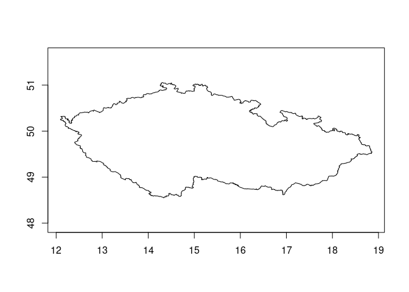
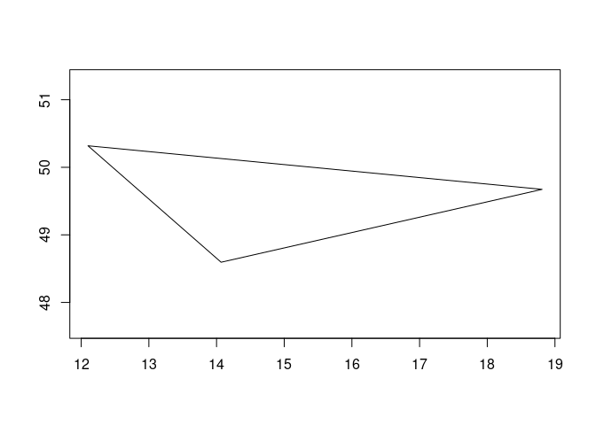
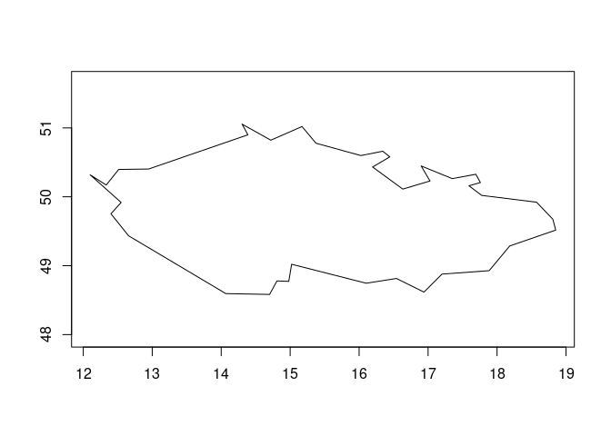
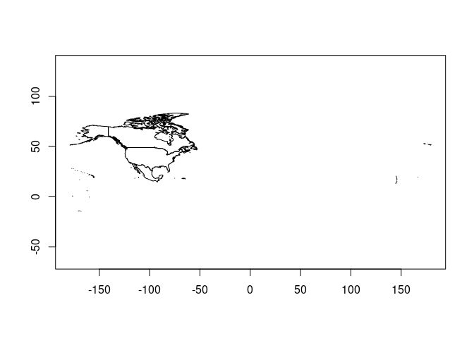
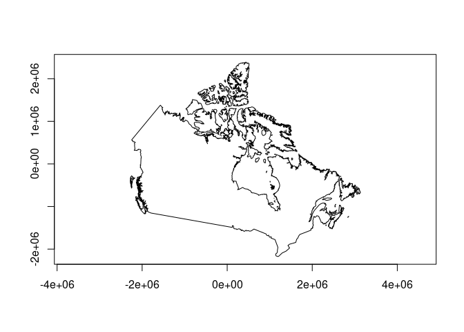
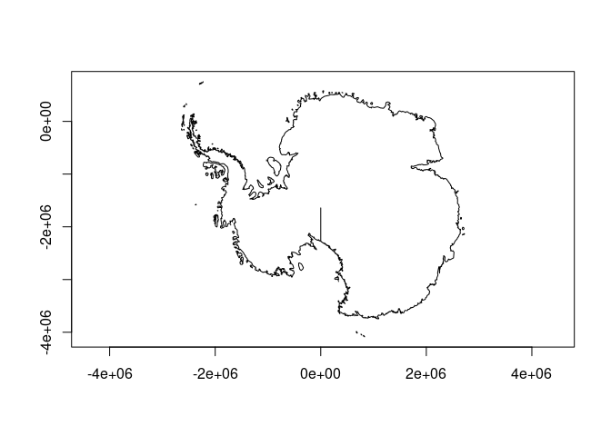

<!-- README.md is generated from README.Rmd. Please edit that file -->

# osgeo.gdal

<!-- badges: start -->
<!-- badges: end -->

The goal of osgeo.gdal is to get access to the Python gdal package. It’s
helping me learn how it works and how GDAL itself works.

## Installation

You can install the development version of osgeo.gdal like so:

``` r
# FILL THIS IN! HOW CAN PEOPLE INSTALL YOUR DEV PACKAGE?
```

## Example

Very silly example for now, we just have a geometry reader and it can be
reprojected to a local crs.

Can turn on the reprojection, can turn on simplification (try reading
just one at a time, it’s about 200Mb of geometry total over a url).

``` r
library(osgeo.gdal)
## basic example code
plot(og_read_geometry(ia = 50))
```



``` r
plot(og_read_geometry(ia = 50, simplify = 1))
```



``` r
plot(og_read_geometry(ia = 50, simplify = .1))
```



``` r

## to get the feature's fields use same index
og_read_fields(ia = 50)
#> # A tibble: 1 × 2
#>   shapeGroup shapeType
#>   <chr>      <chr>    
#> 1 CZE        ADM0

og_read_fields(ia = 60:62)
#> # A tibble: 3 × 2
#>   shapeGroup shapeType
#>   <chr>      <chr>    
#> 1 EST        ADM0     
#> 2 ETH        ADM0     
#> 3 FJI        ADM0

allfields <- og_read_fields(ia = 1:200)

idx <- match(c("CAN", "MEX", "USA"), allfields$shapeGroup)
plot(og_read_geometry(ia = idx, simplify = .05))
```



``` r


## finally, apply the local custom projection
plot(og_read_geometry(ia = idx[1], simplify = .05, localproject = TRUE))
```



``` r

plot(og_read_geometry(ia = which(allfields$shapeGroup == "ATA"), simplify = .05, localproject = TRUE))
```



## Code of Conduct

Please note that the osgeo.gdal project is released with a [Contributor
Code of
Conduct](https://contributor-covenant.org/version/2/1/CODE_OF_CONDUCT.html).
By contributing to this project, you agree to abide by its terms.
